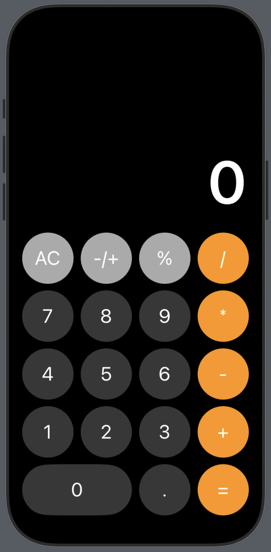

# Calculator App

A simple and elegant calculator app built with **SwiftUI** for iOS. This project demonstrates the use of SwiftUI's declarative syntax to create a fully functional calculator with basic arithmetic operations.


 

---

## Features

- **Basic Operations**: Addition, subtraction, multiplication, and division.
- **Clear Functionality**: Reset the calculator with the `AC` button.
- **Decimal Support**: Perform calculations with decimal numbers.
- **Responsive Design**: Adapts to different screen sizes.
- **Modern UI**: Clean and intuitive user interface.

---

## How It Works

The calculator is built using SwiftUI's declarative syntax. Here's a breakdown of the key components:

1. **Button Layout**:
   - The calculator buttons are organized in a grid using a 2D array (`buttons: [[CalcButton]]`).
   - Each button is represented by an enum (`CalcButton`) with a corresponding raw value (e.g., `one = "1"`).

2. **State Management**:
   - `@State` variables are used to manage the calculator's state:
     - `value`: The current value displayed on the screen.
     - `runningNumber`: Stores the running value for calculations.
     - `currentOperation`: Tracks the current arithmetic operation.

3. **Button Actions**:
   - The `didTap` function handles button presses and performs the appropriate action based on the button type (e.g., number, operation, clear).

4. **Dynamic Sizing**:
   - Button sizes are calculated dynamically based on the screen width to ensure a responsive layout.

---

## Code Structure

### Enums
- **`CalcButton`**: Represents the calculator buttons and their display values.
- **`Operation`**: Represents the arithmetic operations (add, subtract, multiply, divide).

### State Variables
- `@State var value = "0"`: The current value displayed on the screen.
- `@State var runningNumber = 0`: Stores the running value for calculations.
- `@State var currentOperation: Operation = .none`: Tracks the current operation.

### Functions
- **`didTap(button: CalcButton)`**: Handles button presses and performs calculations.
- **`buttonWidth(item: CalcButton) -> CGFloat`**: Calculates the width of a button.
- **`buttonHeight() -> CGFloat`**: Calculates the height of a button.

---

## Installation

1. Clone the repository:
   ```bash
   git clone https://github.com/your-username/calculator-app.git
2. Open the project in Xcode.
3. Build and run the app on  an IOS simulator or device.
